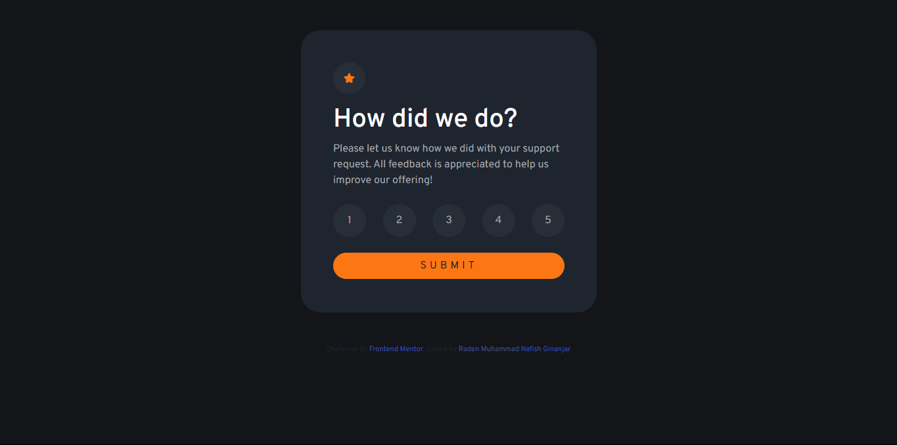

# Frontend Mentor - Interactive rating component solution

This is a solution to the [Interactive rating component challenge on Frontend Mentor](https://www.frontendmentor.io/challenges/interactive-rating-component-koxpeBUmI). Frontend Mentor challenges help you improve your coding skills by building realistic projects. 

## Table of contents

- [Overview](#overview)
  - [The challenge](#the-challenge)
  - [Screenshot](#screenshot)
  - [Links](#links)
- [My process](#my-process)
  - [Built with](#built-with)
  - [What I learned](#what-i-learned)
- [Author](#author)

## Overview

### The challenge

Users should be able to:

- View the optimal layout for the app depending on their device's screen size
- See hover states for all interactive elements on the page
- Select and submit a number rating
- See the "Thank you" card state after submitting a rating

### Screenshot




### Links

- Solution URL: [Add solution URL here](https://your-solution-url.com)
- Live Site URL: [Add live site URL here](https://muhammadnafishginanjar.github.io/Interactive-Rating-Component/)

## My process

### Built with

- Semantic HTML5 markup
- CSS custom properties
- JavaScript
- [Bootstrap 4](https://getbootstrap.com/) - HTML, CSS, and JavaScript framework

### What I learned

I've learned a new property in JS, where the property can delete or add classes in HTML.

Here's the code:
```js
  firstPage.classList.add("d-none")
  firstPage.removeAttribute("id")
  thankyouPage.classList.remove("d-none");
```

## Author

- Frontend Mentor - [@MuhammadNafishGinanjar](https://www.frontendmentor.io/profile/MuhammadNafishGinanjar)
